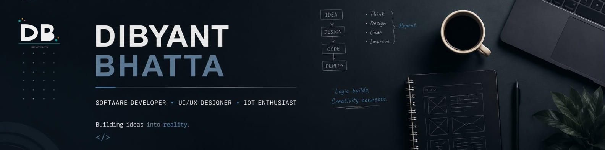

  

<h1 align="center">Hey 👋, I'm Dibyant Bhatta</h1>

  <strong>Software Developer • Full Stack Enthusiast • UI/UX Explorer • IoT Builder</strong>

Building software, designing experiences, and turning ideas into reality.

---

## 👨‍💻 About Me

I'm a software developer who enjoys building applications that are practical, intuitive, and enjoyable to use. I love exploring new technologies, solving challenging problems, and bringing ideas to life through clean code and thoughtful design.

Currently, I'm expanding my skills in full-stack development while working on projects that combine software engineering, UI/UX, and IoT.

---

## 🚀 Currently Working On

- 🌱 Learning **Spring Boot**, **React**, and **Docker**
- 💻 Building modern full-stack web applications
- 🤖 Developing IoT projects using **ESP32** and **Arduino**
- 🎨 Improving UI/UX design skills
- 📚 Continuously learning new technologies

---

## 🛠️ Tech Stack

### Languages

- Java
- JavaScript
- Python
- HTML5
- CSS3
- SQL

### Frameworks & Libraries

- Spring Boot
- React
- Node.js

### Databases

- MySQL

### Tools & Technologies

- Git
- GitHub
- Docker
- VS Code
- IntelliJ IDEA
- Figma
- Arduino IDE

---

## 🌟 Featured Projects

### 🌿 Finora

A modern e-commerce platform designed to deliver a clean, premium shopping experience with scalable architecture.

---

### ⏱️ Cronoz

A productivity and task management application focused on helping users organize their schedules and stay productive.

---

### 🎨 ArtSphere

A platform built for artists to showcase their work, connect with the creative community, and grow their online presence.

---

### 🤖 Security Surveillance Spider Bot

An IoT-powered hexapod robot featuring remote control, live ESP32-CAM video streaming, and intelligent surveillance capabilities.

---

## 📖 What I'm Learning

- Spring Boot
- REST APIs
- React
- Docker
- Cloud Computing
- Software Architecture

---

## 🎯 Goals

- Build impactful real-world software
- Contribute to open-source projects
- Expand my knowledge of backend systems
- Create intuitive digital experiences
- Continuously improve as a developer

---

## 📫 Connect With Me

- 💼 LinkedIn: *(Add your LinkedIn URL)*
- 📧 Email: *(Add your email)*
- 🌐 Portfolio: *(Coming Soon)*

---

Thanks for visiting my profile! 🚀

